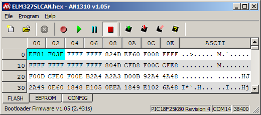
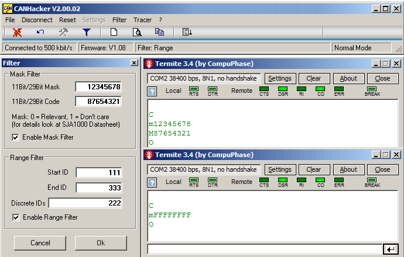
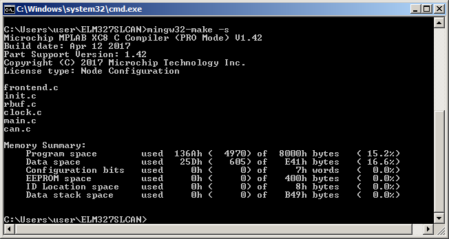

#### ELM327SLCAN

The cheap vehicle's CAN bus sniffer based on ELM327, special [bootloader](https://github.com/qnx425/PIC18F25K80-Bootloader), and [USBtin](https://fischl.de/usbtin/).
With this device you can monitor vehicle's CAN bus. Monitoring software – [CANHacker](https://cdn.hackaday.io/files/12644540960896/CANHackerV2.00.02.zip) or [similar](https://fischl.de/usbtin/#usbtinviewer).

##### LEDs

1. Red – power supply.
2. Green – current connection status. If lights steady – connection is open. Flashes once in three seconds – connection is closed.
3. Orange – error status.
   - If lights steady – serial port buffer overflow error. This error occurs when the MCU does not have time to read the next command from PC. You can reset this error only by turning off the power supply.
   - One flash in three seconds – CAN messages FIFO-buffer overflow in MCU. The depth of a FIFO-buffer is eight messages. Then the ninth message is received, this error is raised.
   - Double flash in three seconds – internal text buffer overflow in MCU. This error is raised then the rate of incoming CAN-messages is very high and MCU does not have time to send them to PC.
   - Triple flash in three seconds – internal text buffer overflow in MCU. This error is raised then the rate of incoming commands from PC is very high and MCU does not have time to process them all.

		The last three errors could be reset with f2 command.

##### Switch to Bootloader mode for firmware update:

1.	Issue the command B10[CR] in RS232 terminal software (for instance, [termite](https://www.compuphase.com/software_termite.htm)).
2.	Disconnect the COM port in RS232 terminal software.
3.	Press the red button 'Bootloader Mode' in [Serial Bootloader AN1310](http://ww1.microchip.com/downloads/en/AppNotes/Serial%20Bootloader%20AN1310%20v1.05r.zip) software.
4.	Switching to Bootloader mode is reflected in the status bar.
5.	Update the firmware.
6.	To start the updated application it is need to turn off and on the power.

##### Filtering

Implemented filtering 'Single filter mode' with three modifications as described in [SJA1000](https://www.nxp.com/docs/en/data-sheet/SJA1000.pdf) datasheet and [AN97076](https://www.nxp.com/docs/en/application-note/AN97076.pdf). The differences:

1.	RTR bit does not take part in filtering.
2.	Two message's bytes do not take part in filtering. LSB ACR3 must be zero in case of work in CAN bus with 11-bit IDs.
3.	LSB ACR3 is copied to EXIDEN bit of RXF0SIDL. LSB AMR3 is copied to EXIDEN bit of RXM0SIDL. See the PIC18FXXK80 datasheet. One mask (RXM0) and one filter (RXF0) are used.

To activate the CANHacker Filter settings it is necessary that the connection has been already established (Connected to …). So - see the first Termite window:

1.	Establish connection.
2.	Click Filter button.
3.	Set Mask Filter in the upper group box.
4.	Click OK button. As a result, we get ‘close’, ‘set mask’, ‘set filter’, ‘open’ commands.

Range Filter filtering (lower group box) works in software. Issued command allows all incoming messages (mFFFFFF). 

If you remove both checkboxes and press OK button, issued command allows all incoming messages (mFFFFFF). See the second Termite window.

##### Bluetooth

Bluetooth name: OBDII  
Bluetooth PIN: 1234  
Serial port settings: 38400, 8n1

##### To build new firmware, it is need to install Microchip XC8 Compiler and MinGW.

